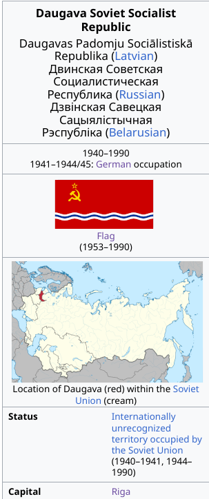

# Images
Here's a catalogue of some images I've made.

<main class="catalog">
<article>

<h3> Flag of Belaro-Daugava SSR</h3>

Flag of Daugava with an additional Belarusian stripe.

</article>
<article>

<h3> Flag of Belaro-Daugava SSR</h3>

Flag of the anglophone world

</article>
<article>

<h3> Flag of Belaro-Daugava SSR</h3>

Flag of Daugava with an additional Belarusian stripe.

</article>
<article>

<h3> Flag of Belaro-Daugava SSR</h3>

Redesign of the twitter logo

</article>
<article>

<h3> Latvian Lyndon LaRouche</h3>

Latvian Lyndon LaRouche agrees.

</article>
<article>

<h3> Flag of Belaro-Daugava SSR</h3>

Flag of Lithuania-Belarus which combines the flag of Belarus and the Lithuanian SSR

</article>
<article>

<h3> Flag of Belaro-Daugava SSR</h3>

Flag of Daugava with an additional Belarusian stripe.

</article>

</main>

