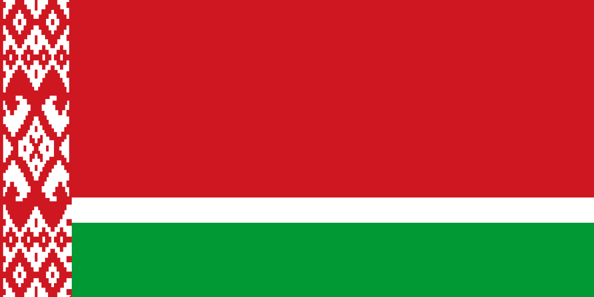
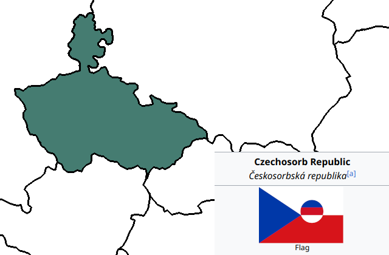
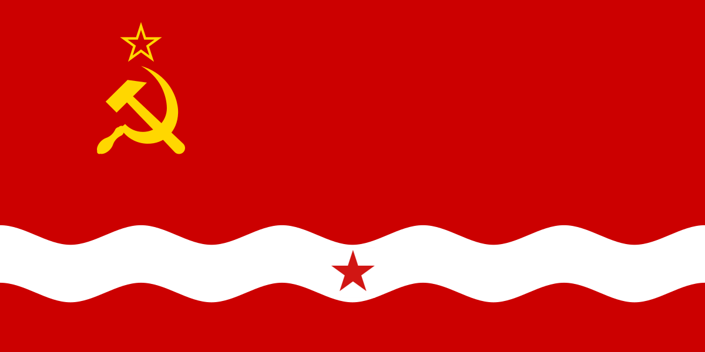

# Images
Here's a catalogue of some images I've made.

<main class="catalog">
<article>

<h3> Flag of Belaro-Daugava SSR</h3>

Flag of Daugava with an additional Belarusian stripe.

</article>
<article>

<h3> Flag of the anglophone world</h3>

combination of USA, Nigerian, Indian and Pakistani flags

</article>
<article>

<h3>Territorial divisions of Daugava</h3>

The divisions are based on river basin borders.

</article>
<article>

<h3>Twitter</h3>

Redesign of the Twitter logo

</article>
<article>

<h3> Latvian Lyndon LaRouche</h3>

Latvian Lyndon LaRouche agrees.

</article>
<article>

<h3> Flag of Belarus and Eastern Lithuania</h3>

Flag of Lithuania-Belarus which combines the flag of Belarus and the Lithuanian SSR

</article>
<article>

<h3>Infobox of Daugava SSR</h3>

Wikipedia-style infobox of Daugava

</article>
<article>

<h3>Map and flag of Sorbo-Czecho-Slovak republic</h3>

Czechoslovakia + Sorbs

</article>
<article>

<h3>Map of Czecho-Sorbia</h3>

Slovakia seceded.

</article>
<article>

<h3> Flag of wavy Latvian SSR</h3>

Remix of the latvian SSR flag

</article>
<article>

<h3> Flag of Latvian SSR</h3>

Incorporation of various elements in the Iskolat flag into Latvian SSR flag

</article>
</main>

